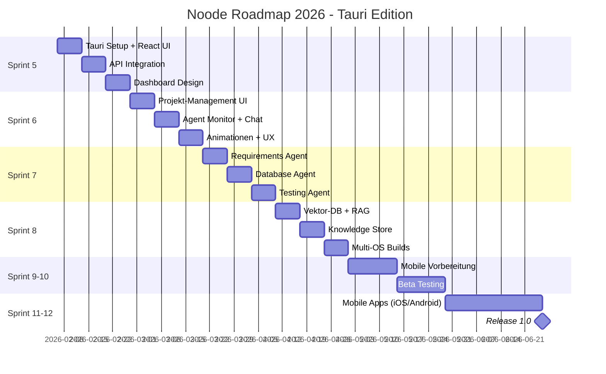

# Projektplan – Noode - Roadmap zur Version 1.0

**Version:** 2.0 - Tauri Web-UI Edition  
**Datum:** 2026-02-06  
**Status:** Sprint 5 - Tauri UI Implementation

---

## 🎯 Vision

Noode ist eine **autonome AI-Entwicklungsplattform** für Windows, macOS und Linux ( später iOS & Android ), mit einem modernen, professionellen UI. Die Plattform nutzt spezialisierte AI-Agents um Software-Projekte vollständig automatisch zu entwickeln.

---

## 📊 Projektübersicht

### Sprint-Timeline



---

## 🏗️ Architektur

### Tech Stack

| Layer | Technologie | Zweck |
|-------|-------------|-------|
| **Frontend** | React 18 + TypeScript | UI Components |
| **Styling** | Tailwind CSS + Framer Motion | Design & Animationen |
| **Desktop** | Tauri (Rust) | Native Desktop App |
| **Backend** | Python + FastAPI | API & Business Logic |
| **AI** | LiteLLM | LLM Abstraction |
| **Database** | SQLite + Qdrant | Daten & Vektor-Store |
| **Mobile** | Tauri Mobile | iOS & Android (später) |

### Projektstruktur

```
03_Entwicklung/
├── src/noode/                    # Python Backend
│   ├── agents/                   # AI Agents (7 total)
│   │   ├── backend_agent.py     # ✅ Sprint 0-4
│   │   ├── frontend_agent.py    # ✅ Sprint 0-4
│   │   ├── research_agent.py    # ✅ Sprint 0-4
│   │   ├── security_agent.py    # ✅ Sprint 0-4
│   │   ├── requirements_agent.py # 🔄 Sprint 7
│   │   ├── database_agent.py     # 🔄 Sprint 7
│   │   └── testing_agent.py      # 🔄 Sprint 7
│   ├── core/                     # Core Logic
│   │   ├── base_agent.py        # ✅
│   │   ├── orchestrator.py      # ✅
│   │   ├── memory.py            # ✅
│   │   ├── knowledge_store.py   # 🔄 Sprint 8
│   │   ├── project_manager.py   # ✅
│   │   └── session_manager.py   # ✅
│   ├── api/                      # FastAPI
│   │   ├── server.py            # ✅
│   │   ├── routes.py            # ✅
│   │   └── models.py            # ✅
│   ├── protocols/               # Messages & Consensus
│   │   ├── messages.py          # ✅
│   │   └── consensus.py         # ✅
│   └── utils/                   # Utilities
│       ├── logging.py           # ✅
│       └── validation.py        # ✅
│
├── tauri-ui/                    # 🆕 NEU: Tauri Frontend
│   ├── src/                     # React Source
│   │   ├── components/          # UI Components
│   │   ├── pages/              # Screens
│   │   ├── hooks/              # Custom Hooks
│   │   └── api/                # API Client
│   ├── src-tauri/              # Rust Backend
│   ├── package.json            # Dependencies
│   └── tailwind.config.js      # Styling
│
├── tests/                       # Test Suite
│   ├── test_core.py            # ✅
│   ├── test_agents.py          # ✅
│   ├── test_sprint2.py         # ✅
│   ├── test_sprint3.py         # ✅
│   └── test_sprint4.py         # ✅
│
└── docs/                       # Dokumentation
    ├── architecture/           # Architektur-Docs
    ├── api/                    # API Dokumentation
    └── ui/                     # UI/UX Guidelines
```

---

## 📅 Sprint-Planung Detail

### Sprint 5: Tauri Foundation (KW 6-7)
**Zeitraum:** 06.02. - 20.02.2026  
**Ziel:** Funktionierende Desktop-App mit API-Integration

| Aufgabe | Status | Zeit |
|---------|--------|------|
| Tauri Projekt initialisieren | 🔄 In Arbeit | 2 Tage |
| React + Tailwind Setup | ⏳ Geplant | 1 Tag |
| FastAPI API Client | ⏳ Geplant | 2 Tage |
| Dashboard Layout | ⏳ Geplant | 2 Tage |
| Sidebar Navigation | ⏳ Geplant | 1 Tag |
| Dark/Light Mode | ⏳ Geplant | 1 Tag |

**Deliverables:**
- ✅ Tauri läuft lokal
- ✅ Verbindung zu FastAPI
- ✅ Grundlegendes UI sichtbar
- ✅ Navigation funktioniert

---

### Sprint 6: UI Polish & Features (KW 8-9)
**Zeitraum:** 21.02. - 06.03.2026  
**Ziel:** Professionelles UI mit Animationen

| Aufgabe | Status | Zeit |
|---------|--------|------|
| Projekt-Liste View | ⏳ Geplant | 3 Tage |
| "Neues Projekt" Flow | ⏳ Geplant | 3 Tage |
| Agent-Monitor Dashboard | ⏳ Geplant | 2 Tage |
| Chat Interface | ⏳ Geplant | 2 Tage |
| Framer Motion Animationen | ⏳ Geplant | 2 Tage |
| Loading States & Feedback | ⏳ Geplant | 2 Tage |

**Deliverables:**
- ✅ Vollständiges Projekt-Management
- ✅ Schöne Animationen
- ✅ Intuitive UX für Laien
- ✅ Windows/macOS/Linux Builds

---

### Sprint 7: Missing Agents (KW 10-11)
**Zeitraum:** 07.03. - 20.03.2026  
**Ziel:** Alle 7 Agents implementiert

| Agent | Status | Zweck |
|-------|--------|-------|
| RequirementsAgent | ❌ Fehlt | Anforderungsanalyse |
| DatabaseAgent | ❌ Fehlt | Schema-Design & Queries |
| TestingAgent | ❌ Fehlt | Test-Generierung |

**Deliverables:**
- ✅ 7/7 Agents vollständig
- ✅ Jedes Agent-UI im Frontend
- ✅ Integration mit Orchestrator

---

### Sprint 8: Knowledge & Deployment (KW 12-13)
**Zeitraum:** 21.03. - 03.04.2026  
**Ziel:** Intelligentes System mit RAG

| Aufgabe | Status | Zeit |
|---------|--------|------|
| Qdrant Vektor-DB Setup | ⏳ Geplant | 2 Tage |
| Embedding Service | ⏳ Geplant | 2 Tage |
| RAG Retrieval | ⏳ Geplant | 3 Tage |
| Knowledge Store UI | ⏳ Geplant | 2 Tage |
| CI/CD GitHub Actions | ⏳ Geplant | 2 Tage |
| Auto-Builds für alle OS | ⏳ Geplant | 3 Tage |

**Deliverables:**
- ✅ Vektor-basierte Suche
- ✅ Knowledge Management
- ✅ Automatische Releases
- ✅ Windows (.exe), macOS (.dmg), Linux (.AppImage)

---

### Sprint 9-10: Beta & Polish (KW 14-17)
**Zeitraum:** 04.04. - 01.05.2026  
**Ziel:** Beta-Version bereit für Tester

- Beta Testing mit Nutzern
- Bugfixes
- Performance Optimierung
- Dokumentation vervollständigen

---

### Sprint 11-12: Mobile (KW 18-25)
**Zeitraum:** 02.05. - 27.06.2026  
**Ziel:** iOS & Android Apps

- Tauri Mobile aktivieren
- Touch-Optimierung
- Mobile-UI Anpassungen
- App Store / Play Store Release

---

## ✅ Meilensteine

| Meilenstein | Datum | Status |
|-------------|-------|--------|
| EP1: Projekt genehmigt | 06.02.2026 | ✅ Abgeschlossen |
| EP2: Anforderungen definiert | 06.03.2026 | ✅ Abgeschlossen |
| EP3: System entworfen | 20.03.2026 | ✅ Abgeschlossen |
| EP4: Tauri UI MVP | 20.02.2026 | 🔄 Sprint 5 |
| EP5: Alle Agents | 20.03.2026 | ⏳ Sprint 7 |
| EP6: Vektor-DB + RAG | 03.04.2026 | ⏳ Sprint 8 |
| EP7: Beta Release | 01.05.2026 | ⏳ Sprint 10 |
| EP8: Mobile Release | 27.06.2026 | ⏳ Sprint 12 |

---

## 🎯 Erfolgskriterien

### MVP (Sprint 8)
- [ ] User kann Projekt erstellen
- [ ] 7 Agents arbeiten zusammen
- [ ] Live-Chat mit Agents
- [ ] Vektor-basierte Suche
- [ ] Windows, macOS, Linux Builds
- [ ] < 10 MB Bundle-Größe

### Release 1.0 (Sprint 12)
- [ ] Alle Features aus MVP
- [ ] iOS & Android Apps
- [ ] < 20 MB Mobile Bundle
- [ ] Professionelle Animationen
- [ ] 99% Uptime
- [ ] 5-Sterne Bewertungen

---

## 📋 Ressourcen

| Ressource | Verfügbarkeit |
|-----------|---------------|
| AI-Entwicklung | 100% |
| UI/UX Design | Tauri + React |
| Testing | Automatisiert + Beta-User |
| Infrastructure | GitHub Actions + Cloud |

---

## 🔄 Änderungshistorie

| Version | Datum | Änderung |
|---------|-------|----------|
| 1.0 | 06.02.2026 | Ursprünglicher Plan (GTK3) |
| 2.0 | 06.02.2026 | Umstellung auf Tauri Web-UI |
